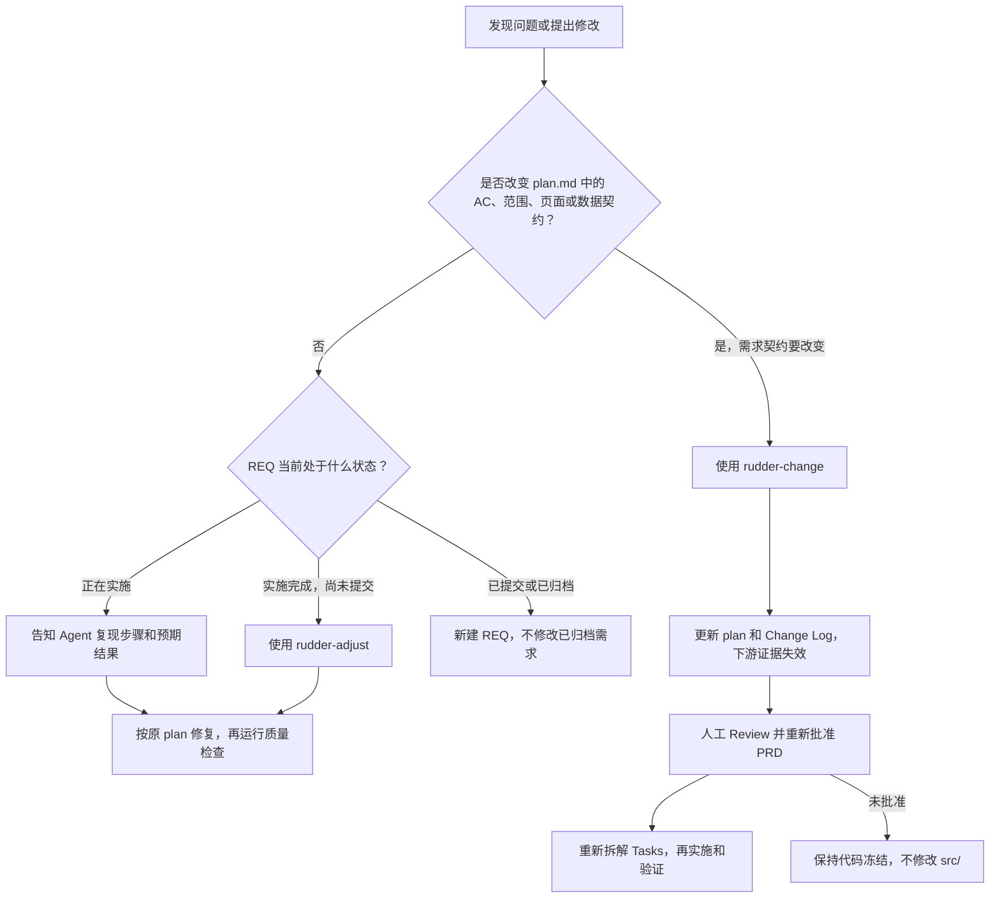

# Rudder Framework 新手教程

本教程带你完成一次从安装依赖到启动项目、选择需求入口和完成代码检查的完整流程。

**快速跳转：**[准备环境](#1-准备环境) · [安装项目](#2-获取项目并安装依赖) · [启动开发服务器](#3-启动开发服务器) · [创建需求](#5-创建第一个需求) · [实施与提交](#6-实施和提交需求) · [修复 Bug / 变更需求](#7-修复-bug-或变更需求) · [命令速查](#9-命令速查) · [完成前检查](#10-完成前检查清单)

## 使用路径总览

先判断你手上的输入：

| 输入 | 入口 | 说明 |
|---|---|---|
| 一份完整需求文档 | `/rudder-import` | 只做归一化、粗读和功能点拆分 |
| 一个新想法或单个功能 | `/rudder-plan` | 直接进入详细 PRD 设计 |

两条路径都会在 `plan.md` 批准后进入同一条实施流程：

```text
Plan → Tasks → Implement → Commit
```

## 1. 准备环境

需要安装：

- Node.js 20.19 或更高版本
- npm（随 Node.js 一起安装）
- Git
- 一个支持本项目 Rudder 技能的 Agent 运行时，例如 Claude Code

检查版本：

```bash
node --version
npm --version
git --version
```

## 2. 获取项目并安装依赖

如果项目还没有下载到本机：

```bash
git clone <项目地址>
cd ProtoSource
```

进入项目目录后安装依赖：

```bash
npm install
```

依赖安装完成后，项目会生成 `node_modules/`。该目录不需要提交到 Git。

## 3. 启动开发服务器

运行：

```bash
npm run dev
```

终端会显示本地访问地址，通常是：

```text
http://localhost:5173
```

修改 `src/` 下的代码后，浏览器会自动刷新。停止服务器可以在终端按 `Ctrl+C`。

## 4. 先跑一遍项目校验

在开始开发前，建议执行：

```bash
npm run typecheck
npm run lint
npm run build
```

这些命令分别检查 TypeScript 类型、代码规范和生产构建。任何命令失败时，先处理报错，再继续工作。

Rudder 规则和需求数据还可以使用以下校验：

```bash
npm run check:req
npm run check:skills
npm run sync:master -- --check
```

需求仓库为空时，`check:req` 也应正常通过；第一次创建需求后，它会开始检查需求目录和状态。

## 5. 创建第一个需求

有两种入口。

### 方式 A：已有文档，先粗拆分

如果你手上有完整需求文档：

```text
/rudder-import 需求文档.docx
```

Import 只生成归一化文档、粗拆分分析和候选 REQ，不做详细 PRD。命令会暂停等待你确认功能点拆分。确认时回复：

```text
拆分批准，创建 REQ 目录
```

REQ 目录创建后，必须对每个 REQ 单独执行 `/rudder-plan`：

```text
/rudder-plan REQ-001
```

此时才补充用户故事、AC、页面结构、UI 三态、数据模型和技术契约。

Plan 完成后先 Review 新计划，再对该 REQ 执行 `/rudder-plan-confirm REQ-001`，并明确批准。若使用 Hermes，请调用 `rudder-plan-confirm` 技能。命令调用本身不代表批准。

### 方式 B：直接描述需求

没有完整文档时，在 Agent 对话中输入：

```text
/rudder-plan 做一个供应商列表页面，支持加载、错误和空数据状态
```

Agent 会先提出澄清问题，然后在 `requirements/REQ-XXX-<name>/` 下生成需求计划，并保持 `plan.md` 为 `DRAFT`。检查 `plan.md` 内容无误后，执行确认命令：

```text
/rudder-plan-confirm REQ-001
```

然后明确回复：

```text
PRD 批准，状态改为 APPROVED
```

如果使用 Hermes，请调用 `rudder-plan-confirm` 技能并提供对应的 REQ-ID。确认命令会检查未解决的问题；命令调用本身不代表批准。只有收到明确批准且 `npm run check:req` 通过后，才能开始 `/rudder-implement`。

## 6. 实施和提交需求

需求计划批准后，按顺序执行：

```text
/rudder-implement REQ-001
/rudder-commit REQ-001
```

各阶段职责如下：

| 阶段 | 作用 |
| --- | --- |
| Plan | 明确范围、用户场景和验收标准 |
| Tasks | 将验收标准拆成可执行任务 |
| Implement | 按 Types、Mocks、Services、UI 顺序实施 |
| Implement | 运行类型检查、Lint、Build 和规则校验，并记录到 `implement.md` |
| Commit | 提交代码并归档需求证据 |

不要在未批准 PRD 时直接修改 `src/`。如果需求范围发生变化，使用：

```text
/rudder-change REQ-001 增加供应商筛选功能
```

## 7. 修复 Bug 或变更需求

先判断问题属于“实现没有满足已批准的需求”，还是“现在要改变需求”。两者走不同流程：



### 修复 Bug：需求不变，只修实现

例如：列表按已批准的规则应显示供应商，但页面报错或数据显示不正确。这属于实现缺陷，不需要改变 `plan.md` 的验收标准（AC）。

- **需求正在实施**：告诉 Agent 目标 REQ、复现步骤、实际结果和预期结果，并说明按已批准的 `plan.md` 修复。修复后重新运行该需求的质量检查，并更新 `tasks.md` / `implement.md` 中的任务状态和验证记录。
- **Implement 已完成但尚未提交**：使用 `/rudder-adjust`，例如：`/rudder-adjust REQ-001 修复供应商列表在接口返回错误时页面崩溃的问题，预期显示错误状态`。该入口只适用于需求契约不变的实现修改；修改后会重跑质量检查。
- **需求已提交或归档**：不要改动已归档 REQ。通过 `/rudder-plan` 创建新 REQ，并在计划中说明它继承或扩展自原 REQ。

### 变更需求：修改已批准的契约

例如：新增筛选条件、改变页面结构或业务规则、增加数据字段，或修改验收标准。这些会改变需求契约，必须使用 `/rudder-change`，不能直接改 `src/`：

```text
/rudder-change REQ-001 增加按供应商状态筛选的功能
```

变更流程会更新 `plan.md` 中的用户故事和 AC，记录包含日期、内容、原因、影响范围的 Change Log，并将 `plan.md` 退回 `DRAFT`、`tasks.md` 退回 `DRAFT`、`implement.md` 标记为 `OUTDATED`。在你 Review 新计划并回复“PRD 批准，状态改为 APPROVED”之前，代码保持冻结；批准后再重新拆解 Tasks、实施并验证。

如果修改会影响其他 REQ，依赖需求会被标记为 `STALE`。是否确实受影响由人工逐个判断，不要自行清除该标记。已提交或归档的需求同样不能原地变更，应新建 REQ。

## 8. 常见文件位置

```text
src/                    页面、组件、服务和状态管理
requirements/           REQ 需求文档与验证证据
skills/                 技能源文件，只在这里修改技能
.rudder/                工作流规则、状态定义和模板
scripts/                确定性检查与同步工具
docs/                   教程和框架说明
```

修改 `skills/` 后必须同步运行时投影：

```bash
npm run sync:skills
npm run check:skills
```

## 9. 命令速查

按需复制命令。`<...>` 表示需要替换的参数；`REQ-001` 和示例文件名也应替换成当前项目中的实际值。

### 终端命令

| 用途 | 命令 | 说明 |
|---|---|---|
| 检查 Node.js | `node --version` | 查看 Node.js 版本 |
| 检查 npm | `npm --version` | 查看 npm 版本 |
| 检查 Git | `git --version` | 查看 Git 版本 |
| 克隆项目 | `git clone <项目地址>` | 仅在项目尚未下载时执行 |
| 进入项目目录 | `cd <项目目录>` | 将占位符替换为克隆后生成的目录名 |
| 安装依赖 | `npm install` | 在项目根目录执行 |
| 开发预览 | `npm run dev` | 启动开发服务器；按 `Ctrl+C` 停止 |
| 预览生产构建 | `npm run build`，再执行 `npm run preview` | 先构建，再本地预览构建结果 |
| 类型检查 | `npm run typecheck` | 执行 TypeScript 检查 |
| 代码规范 | `npm run lint` | 执行 ESLint 检查 |
| 生产构建 | `npm run build` | 验证项目能否构建 |
| 需求状态校验 | `npm run check:req` | 检查 REQ 结构、任务和状态一致性 |
| 技能投影校验 | `npm run check:skills` | 检查技能源文件与生成文件是否一致 |
| 生成技能投影 | `npm run sync:skills` | 修改 `skills/` 后同步运行时文件 |
| 更新需求索引 | `npm run sync:master` | 根据 REQ 更新 `MASTER-PRD.md` 索引 |
| 检查需求索引 | `npm run sync:master -- --check` | 只检查索引，不写入文件 |
| 归一化需求文档 | `node scripts/import-docx.js <输入文件>` | 可选底层命令；通常使用 `/rudder-import <文档路径>`，由 Agent 串起完整导入流程 |
| 检查导入产物 | `node scripts/check-import.js <IMP目录>` | 校验指定 IMP 目录中的导入产物 |

完成开发或修复后，通常运行以下质量检查：

```bash
npm run typecheck
npm run lint
npm run build
npm run check:skills
npm run check:req
```

### Agent 工作流命令

以下斜杠命令适用于 Claude Code 等支持该命令格式的运行时。使用 Hermes 时，用自然语言提出相同意图即可。

| 阶段或用途 | 命令 | 何时使用 |
|---|---|---|
| 导入需求文档 | `/rudder-import <文档路径>` | 导入 `.docx`、`.md` 或 `.txt`，分析拆分后等待人工批准 |
| 创建或细化需求 | `/rudder-plan <需求描述或 REQ-ID>` | 新建需求，或细化导入生成的 REQ 计划 |
| 确认 PRD | `/rudder-plan-confirm <REQ-ID>` | PRD 批准状态或澄清项仍不明确时使用 |
| 实施需求 | `/rudder-implement <REQ-ID>` | PRD 已批准后拆分任务、实施并执行质量检查 |
| 修正已完成实现 | `/rudder-adjust <REQ-ID> <修改说明>` | Implement 已完成但未提交，且修改不改变需求契约 |
| 变更需求契约 | `/rudder-change <REQ-ID> <变更说明>` | 修改验收标准、范围、页面或数据契约 |
| 提交并归档 | `/rudder-commit <REQ-ID>` | 实施和检查完成、满足提交门禁后使用 |

需求变更示例：

```text
/rudder-change REQ-001 增加按供应商状态筛选的功能
```

Bug 修复示例：

```text
/rudder-adjust REQ-001 修复供应商列表接口错误时页面崩溃的问题
```

`/rudder-adjust` 仅适用于未提交需求且不改变需求契约的修正。若修改需求范围或验收标准，改用 `/rudder-change`；已提交或归档的需求应新建 REQ。

## 10. 完成前检查清单

提交前至少确认：

```bash
npm run typecheck
npm run lint
npm run build
npm run check:req
npm run check:skills
npm run sync:master -- --check
```

如果校验全部通过，再进入人工 Review 和 Commit 阶段。
